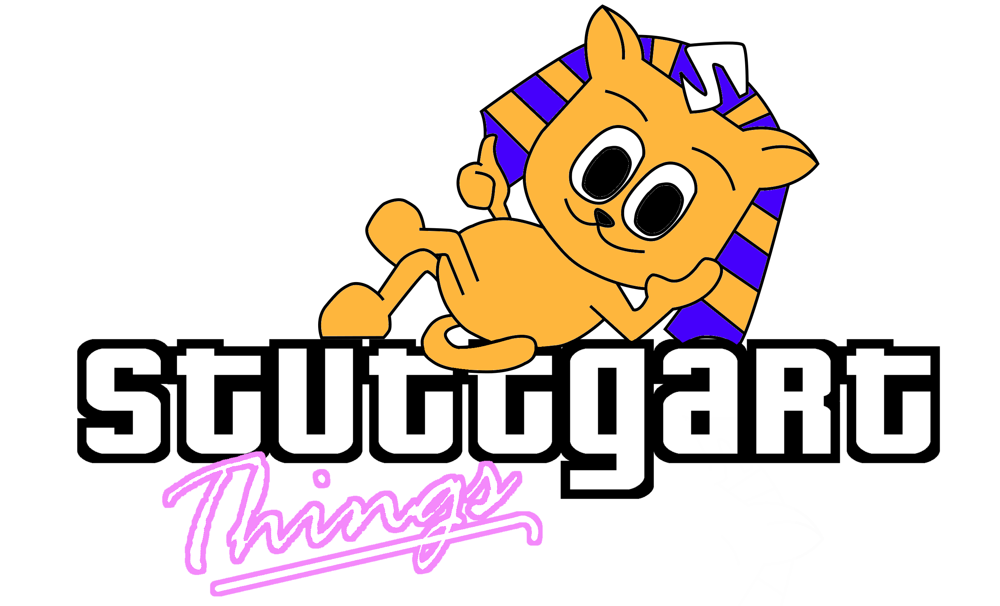

  

    
  

  

    <strong>[sˈθɪŋz]</strong>- using modularity to speed up parallel builds
  

## stuttgart-things 🍿
just a group of engineers sharing their projects codes, configuration & tools (including odds and ends)

### Active Development

#### #GOLANG

##### /PROJECTS

|                     Name | Description                                                                                      | Releases                                               |
| -----------------------: | :----------------------------------------------------------------------------------------------- | :----------------------------------------------------- |
| **[machineShop][machineShop]** | git based CLI interface for managing configuration as code | **[machineShop-releases]** |
| **[machineShop-operator][machineShop-operator]** | manage the lifecycle of terraform resources w/ custom resources on k8s | **[machineShop-operator-releases]** |
| **[stageTime-server][stageTime-server]** | gRPC Server for validating & producing revisionRuns (a collection of tekton pipelineRuns/stages) | **[stageTime-server-releases]** |
| **[stageTime-creator][stageTime-creator]** | dynamic rendering and creation of k8s manifests/resources polled from redis streams/json| **[stageTime-creator-releases]** |

##### /MODULES

|                     Name | Description                                                                                      | Releases                                               |
| -----------------------: | :----------------------------------------------------------------------------------------------- | :----------------------------------------------------- |
| **[sthingsBase][sthingsBase]** | module providing basic golang functions | **[sthingsBase-releases]** |

#### #ANSIBLE

|                     Name | Description                                                                                      | Releases                                               |
| -----------------------: | :----------------------------------------------------------------------------------------------- | :----------------------------------------------------- |
| **[deploy-configure-rke][deploy-configure-rke]** | deploy rancher kubernetes engine + configuration in version 1/2 on linux based systems | **[deploy-configure-rke-releases]** |

[machineShop]: https://github.com/stuttgart-things/machineShop
[machineShop-operator]: https://github.com/stuttgart-things/machineShop-operator
[machineShop-releases]: https://github.com/stuttgart-things/machineShop/releases
[machineShop-operator-releases]: https://console.cloud.google.com/gcr/images/stuttgart-things/eu/machine-shop-operator
[deploy-configure-rke]: https://github.com/stuttgart-things/deploy-configure-rke
[deploy-configure-rke-releases]: https://github.com/stuttgart-things/deploy-configure-rke/tags
[sthingsBase]: https://github.com/stuttgart-things/sthingsBase
[sthingsBase-releases]: https://github.com/stuttgart-things/sthingsBase/tags
[stageTime-server]: https://github.com/stuttgart-things/stageTime-server
[stageTime-server-releases]: https://github.com/stuttgart-things/stageTime-server/releases
[stageTime-creator]: https://github.com/stuttgart-things/stageTime-creator
[stageTime-creator-releases]: https://github.com/stuttgart-things/stageTime-creator/releases

<!--

**Here are some ideas to get you started:**

🙋‍♀️ A short introduction - what is your organization all about?
🌈 Contribution guidelines - how can the community get involved?
👩‍💻 Useful resources - where can the community find your docs? Is there anything else the community should know?
🍿 Fun facts - what does your team eat for breakfast?
🧙 Remember, you can do mighty things with the power of [Markdown](https://docs.github.com/github/writing-on-github/getting-started-with-writing-and-formatting-on-github/basic-writing-and-formatting-syntax)
-->
